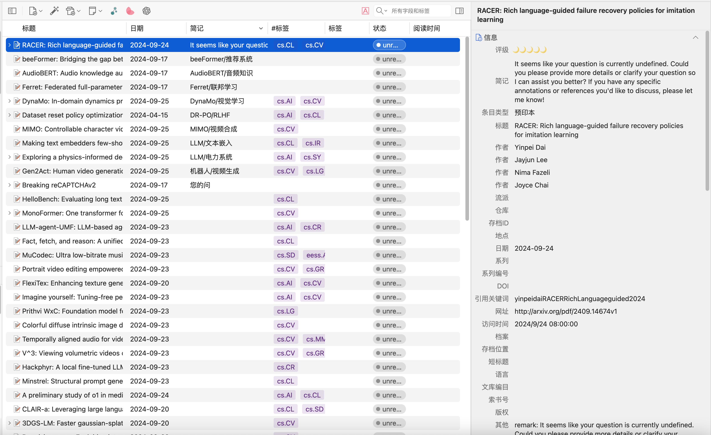
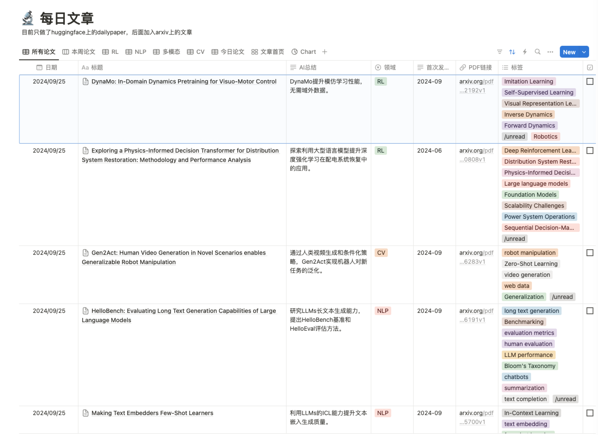
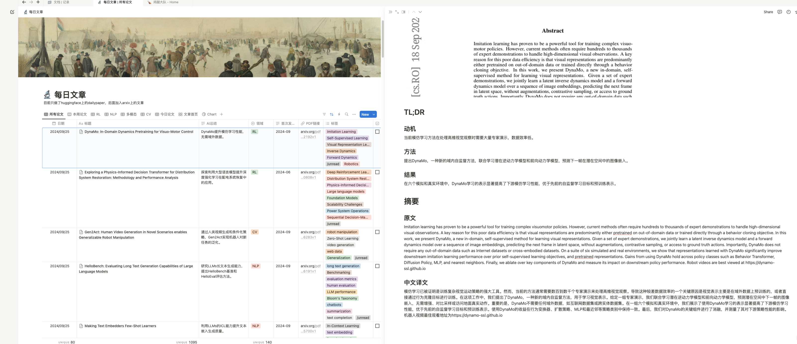
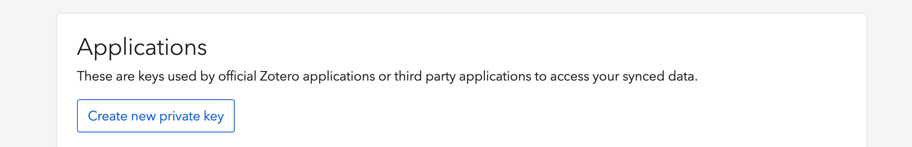

# 概述
本项目升级修改自github某一个repo...时间久远找不到原repo是哪个了，原作者请见谅！


本项目可以扫描HuggingFace的[Daily Papers](https://huggingface.co/papers)页面，解析页面，获取相关论文标题、截图、ID等，调用Arxiv库获取论文更完善的信息，调用LLM API（目前是调用的是Moonshot API）对摘要进行分析，首先翻译成中文，然后解析摘要中提到的论文的动机、方法、结果，并尝试对论文打标签，最后将解析结果，原始论文的链接，使用Notion API，发送到Notion和**Zotero** API。

最终的效果如下图所示：

Zotero展示：



Notion 论文主列表：



详情页：



# 快速上手

## 准备工作

- 申请Moonshot API：如果使用其他LLM的话，在`src/service/llm_service.py`中，替换为其他LLM的相关配置
- Notion配置（可选），这步不申请的话，后续过程论文可以正常获取、解析，但结果无法正常插入Notion
  - 在[此页面](https://www.notion.so/my-integrations)点击Create new integration，创建一个token，创建好之后，记录下Internal Integration Secret，供后续认证使用
  - 在要写入的页面，点击右上角的三个点，在弹出的菜单中，点击Connect to，选择刚才生成的Integration名称
  - 同样点击要写入的页面右上角的三个点，在弹出的菜单中，点击Copy link to view，可以得到类似 https://sheldon123z.notion.site/d7fe8ee7761c4a1fb82dc8f0a07d8fe1?v=bf26f727808c47b4be34536f5e800362&pvs=4 的地址，其中的d7fe8ee7761c4a1fb82dc8f0a07d8fe1 就是要拷贝的Notion DB ID
- Slack API申请（可选），这一步主要是配置定时调度后，将每次程序运行结果发送到Slack，如果不需要的话，这步置空或者随意填写一个字符串即可 
- Zotero API申请（可选），这一步主要是配置定时调度后，将每次程序运行结果发送到Zotero，如果不需要的话，这步置空或者随意填写一个字符串即可 申请地址为 https://www.zotero.org/settings/keys, 注意需要将读写权限打开



## 安装依赖
### 直接安装（不推荐）
```bash
pip install requirements.txt
```
### 使用Conda虚拟环境
使用conda环境的话，可以创建一个新的conda环境，然后安装依赖：

```bash
conda create -n daily_paper_app python=3.10
conda activate daily_paper_app
pip install requirements.txt
```
### 使用pyvenv虚拟环境
使用pyvenv的话，可以创建一个新的虚拟环境，然后安装依赖：

```bash
python3 -m venv daily_paper_app
source daily_paper_app/bin/activate
python setup.py install
```

## 修改启动脚本

修改`bin/start_daily_paper_app.sh`中SLACK_API_KEY、KIMI_API_KEY、NOTION_SECRET、NOTION_DB_ID、ZOTERO_API_KEY、ZOTERO_API_SECRET，其中Zotero的API需要到页面版本Zotero中申请，申请后需要将Zotero API Key和Zotero API Secret填入，否则无法将论文添加到Zotero中，同时，请务必修改每在daily_paper_app.py中每个collection的编号，不然会插入新条目失败

如上所述，只有KIMI_API_KEY是必须的，其他的如果不需要可以随意输入其他字符串，如果需要使用其他的LLM，请修改`src/service/llm_service.py`中相关配置以及`bin/start_daily_paper_app.sh`中相关配置


## 启动程序

```bash
sh bin/start_daily_paper_app_example.sh
```
## 修改配置文件
新增了在arxiv上使用分类进行搜索的能力，具体说明可看[这里](./src/service/config_setting.md)

---
## 定时调度

可以通过crontab来定时调度，比如每天早上8点执行一次，可以添加如下命令：

```bash
crontab -e
```

在打开的文件中添加如下命令：

```bash
0 8 * * * sh /path/to/your/script/start_daily_paper_app.sh
```

其中`/path/to/your/script/start_daily_paper_app.sh`是`start_daily_paper_app.sh`的绝对路径，保存后，crontab会自动生效。

此外，如果你是在conda环境中设置的，那么需要确保在crontab中执行的脚本是在conda环境中执行的，可以通过在执行脚本中添加以下命令来设置：

```bash
. /home/your_user_name/miniconda3/bin/activate your_env_name
cd /path/to/this/project
```

其中`your_user_name`是你的用户名,`your_env_name`是你安装的环境名称。这样在定时执行的时候就可以

---
## Project Roadmap

这是当前项目的开发进度与未来计划。

### 已完成任务 ✅

- [x] 添加定时调度
- [x] 添加 Zotero API
- [x] 添加 Slack API
- [x] 添加 Notion API
- [x] 添加 LLM API
- [x] 添加 Arxiv API
- [x] 添加 HuggingFace API
- [x] 论文LLM解析
- [x] 论文LL智能总结
- [x] 添加论文标签
- [x] 添加论文截图
- [x] 增加LLM智能总结到 zotero extra 字段

### 进行中的任务 ⏳

- [x] 增加 arxiv 特定领域论文订阅
- [ ] 触发器增加邮件/消息/微信通知
- [ ] 增加本地模型调用

### 计划中的任务 🚀

- [ ] 增加论文完全解析（Academic GPT）

