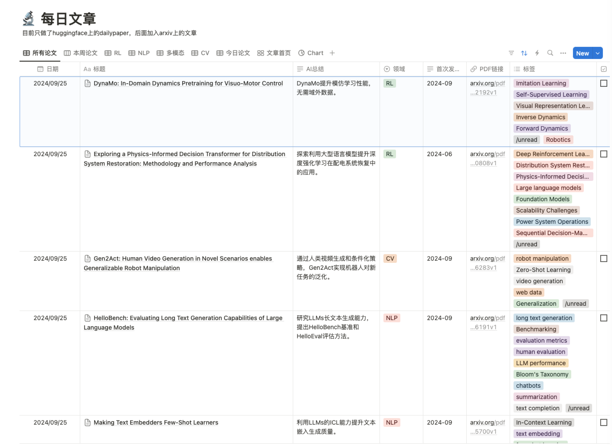
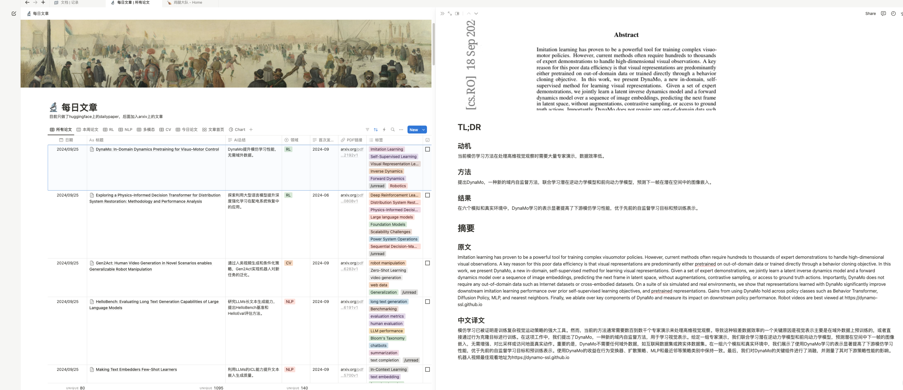

# Zotero-Notion-Paper-Flow

[中文文档](./README.md) | English

An automated academic paper collection and management tool that fetches papers from HuggingFace Daily Papers and arXiv, uses LLM (Moonshot/DeepSeek) for Chinese summary translation and parsing, then syncs to Notion, Zotero, and Wolai.

## Features

- **Multi-source Paper Collection**: Automatically fetch latest papers from HuggingFace Daily Papers and arXiv
- **AI-powered Analysis**: Use LLM to translate abstracts to Chinese, extract key insights (motivation, methods, results), and auto-tag papers
- **Multi-platform Sync**: Simultaneously sync papers to Notion database, Zotero library, and Wolai
- **PDF Download**: Optionally download paper PDFs locally
- **Checkpoint Mechanism**: Avoid duplicate processing of papers
- **Scheduled Execution**: Support crontab scheduled tasks
- **Desktop App**: Electron-based GUI for configuration management

## Screenshots

### Zotero View


### Notion Main List


### Notion Detail Page


## Quick Start

### Prerequisites

- Python 3.9+
- At least one LLM API key (Moonshot/DeepSeek/Zhipu)
- (Optional) Notion Integration Token and Database ID
- (Optional) Zotero API Key
- (Optional) Wolai API credentials

### Installation

```bash
# Clone repository
git clone https://github.com/sheldon123z/Zotero-Notion-Paper-Flow.git
cd Zotero-Notion-Paper-Flow

# Create virtual environment (recommended)
python -m venv venv
source venv/bin/activate  # Linux/Mac
# or
venv\Scripts\activate  # Windows

# Install dependencies
pip install -r requirements.txt
```

### Configuration

#### Environment Variables

Create a `.env` file or export the following environment variables:

```bash
# LLM Services (at least one required)
export DEEPSEEK_API_KEY="your-deepseek-key"
export DEEPSEEK_URL="https://api.deepseek.com/v1"
export DEEPSEEK_MODEL="deepseek-chat"

export KIMI_API_KEY="your-kimi-key"
export KIMI_URL="https://api.moonshot.cn/v1"
export KIMI_MODEL="moonshot-v1-8k"

# Notion (optional)
export NOTION_SECRET="your-notion-secret"
export NOTION_DB_ID="your-database-id"

# Zotero (optional)
export ZOTERO_API_KEY="your-zotero-key"
export ZOTERO_USER_ID="your-user-id"
export ZOTERO_GROUP_ID="your-group-id"  # Optional

# Wolai (optional)
export WOLAI_APP_ID="your-app-id"
export WOLAI_APP_SECRETE="your-app-secret"
export WOLAI_TOKEN="your-token"
export WOLAI_DB_ID="your-db-id"

# Proxy (optional)
export HTTP_PROXY="http://127.0.0.1:7890"
export HTTPS_PROXY="http://127.0.0.1:7890"

# Slack notifications (optional)
export SLACK_API_KEY="your-slack-key"
```

#### Configuration File

Edit `config.json` to customize behavior:

```json
{
    "keywords": ["reinforcement learning", ["power system", "energy"]],
    "categories": ["cs.LG", "cs.AI", "eess.SY"],
    "services": {
        "notion": true,
        "zotero": false,
        "wolai": true
    },
    "download_pdf": true,
    "pdf_dir": "papers",
    "search_limit": 10,
    "category_map": {
        "NLP": ["COLLECTION_ID_1", "COLLECTION_ID_2"],
        "RL": ["COLLECTION_ID_3", "COLLECTION_ID_2"]
    }
}
```

### Usage

#### Command Line

```bash
python src/daily_paper_app.py [options]

# Common options
--keywords "LLM" "RL"       # Search keywords (multiple)
--categories cs.LG cs.AI    # arXiv categories
--date 2025-04-21           # Specific date
--days 3                    # Process past n days
--limit 20                  # Max papers per day
--download-pdf              # Download PDFs
--no-arxiv                  # Skip arXiv fetching
--no-hf                     # Skip HuggingFace fetching
--config ./config.json      # Config file path
```

#### Examples

```bash
# Search for diffusion and RL papers on a specific date
python src/daily_paper_app.py --keywords diffusion "RL" --date 2025-04-21 --download-pdf

# Process past 3 days of papers
python src/daily_paper_app.py --days 3 --limit 10

# Only fetch from HuggingFace (skip arXiv search)
python src/daily_paper_app.py --no-arxiv
```

#### Using Startup Script

```bash
# Copy and edit the example script
cp bin/start_daily_paper_app_example.sh bin/start_daily_paper_app.sh
# Edit environment variables in the script
sh bin/start_daily_paper_app.sh
```

### Scheduled Execution

Add to crontab for daily execution:

```bash
crontab -e

# Add this line (runs at 8 AM daily)
0 8 * * * /path/to/your/script/start_daily_paper_app.sh
```

## Architecture

### Data Flow

```
HuggingFace/arXiv → ArxivVisitor → LLM Translation/Parsing → Notion/Zotero/Wolai
```

### Project Structure

```
src/
├── daily_paper_app.py      # Main entry point, CLI parsing
├── service/
│   ├── arxiv_visitor.py    # arXiv API access and paper search
│   ├── hf_visotor.py       # HuggingFace Daily Papers parsing
│   ├── llm_service.py      # LLM API calls (Moonshot/DeepSeek)
│   ├── notion_service.py   # Notion API integration
│   ├── zotero_service.py   # Zotero API integration
│   ├── wolai_service.py    # Wolai API integration
│   └── pdf_downloader.py   # PDF download
├── entity/
│   └── formatted_arxiv_obj.py  # Paper data entity class
├── services/               # New architecture (v2.0)
│   ├── llm/               # LLM service implementations
│   ├── data_sources/      # Data source implementations
│   └── storage/           # Storage service implementations
├── interfaces/            # Abstract interfaces
├── models/               # Data models
├── config/              # Configuration management
└── core/               # Business logic
```

### Desktop App

The desktop app provides a GUI for configuration management:

```bash
cd desktop-app
npm install
npm run dev        # Development mode
npm start          # Production mode
npm run build:mac  # Build for macOS
npm run build:win  # Build for Windows
```

## API Documentation

See [docs/api.md](docs/api.md) for detailed API documentation.

## Contributing

See [CONTRIBUTING.md](CONTRIBUTING.md) for contribution guidelines.

## Roadmap

### Completed

- [x] Scheduled execution support
- [x] Zotero API integration
- [x] Slack notifications
- [x] Notion API integration
- [x] LLM integration (Moonshot/DeepSeek)
- [x] arXiv API integration
- [x] HuggingFace paper fetching
- [x] LLM paper analysis
- [x] Auto-tagging
- [x] Paper screenshots
- [x] Category-based Zotero insertion
- [x] arXiv category subscription

### In Progress

- [ ] Local model support (Ollama)
- [ ] Enhanced LLM paper analysis
- [ ] Wiki generation for papers

### Planned

- [ ] Advanced subject classification
- [ ] WeChat notifications
- [ ] More data sources (Google Scholar, Semantic Scholar)

## Troubleshooting

See [docs/troubleshooting.md](docs/troubleshooting.md) for common issues and solutions.

## Changelog

See [CHANGELOG.md](CHANGELOG.md) for version history.

## License

This project is licensed under the MIT License - see the [LICENSE.txt](LICENSE.txt) file for details.

## Acknowledgments

- [arxiv](https://arxiv.org/) for paper data
- [HuggingFace](https://huggingface.co/papers) for daily paper curation
- [Notion](https://notion.so) for knowledge management
- [Zotero](https://zotero.org) for reference management
